# OKF Architectural Analysis
**Generated:** 2026-07-22 09:07:14

## God Concepts (Refactor Candidates)

<strong>⚠️ WARNING:</strong> <strong>God Concepts</strong> are files that are unusually large and have a very high number of outgoing links (Fan-Out). They are problematic because they centralize too much information, making them difficult to maintain and violating the Open Knowledge Format principle of atomicity. If a concept appears here, consider breaking it down into smaller, more focused pages.

| File | Fan-Out | Size (chars) | H2 Sections |
|------|---------|--------------|-------------|
| structure/melodic-grammar.md | 6 | 12482 | 10 |
| foundations/periodicity.md | 6 | 6233 | 7 |
| foundations/period.md | 5 | 6643 | 6 |
| domains/rhythm.md | 7 | 12194 | 10 |
| foundations/amplitude-time.md | 5 | 6938 | 8 |
| structure/musicoil.md | 11 | 20997 | 11 |
| perception/temporal-place-limen.md | 5 | 7341 | 7 |
| structure/coil-notation.md | 5 | 9185 | 8 |
| extended/ppt-feature-taxonomy.md | 11 | 15059 | 7 |
| structure/rhythmic-grammar.md | 8 | 18214 | 16 |
| domains/pitch.md | 4 | 5710 | 6 |
| domains/timbre.md | 3 | 7109 | 5 |
| specifications/midi-solfege-input.md | 6 | 6783 | 7 |
| domains/rhythmic-overtone-series.md | 9 | 10958 | 9 |
| uniform-solfege/index.md | 8 | 11389 | 8 |
| reference/metric-duperiod.md | 8 | 16334 | 12 |
| foundations/prime-families.md | 9 | 7741 | 8 |
| foundations/prime-lattice.md | 13 | 27654 | 13 |
| uniform-solfege/diacritic-system.md | 4 | 16404 | 12 |

## Metrics Top 15 (by Fan-in)
| File | Fan-In | Fan-Out | Instability | H2 | Size |
|------|--------|---------|-------------|----|------|
| foundations/prime-families.md | 20 | 9 | 0.31 | 8 | 7741 |
| foundations/periodicity.md | 18 | 6 | 0.25 | 7 | 6233 |
| uniform-solfege/index.md | 14 | 8 | 0.36 | 8 | 11389 |
| perception/temporal-place-limen.md | 13 | 5 | 0.28 | 7 | 7341 |
| reference/metric-duperiod.md | 13 | 8 | 0.38 | 12 | 16334 |
| domains/rhythm.md | 12 | 7 | 0.37 | 10 | 12194 |
| ppd/index.md | 11 | 3 | 0.21 | 7 | 4327 |
| foundations/prime-lattice.md | 10 | 13 | 0.57 | 13 | 27654 |
| structure/melodic-grammar.md | 9 | 6 | 0.4 | 10 | 12482 |
| foundations/amplitude-time.md | 9 | 5 | 0.36 | 8 | 6938 |
| structure/coil-notation.md | 8 | 5 | 0.38 | 8 | 9185 |
| structure/rhythmic-grammar.md | 8 | 8 | 0.5 | 16 | 18214 |
| domains/timbre.md | 8 | 3 | 0.27 | 5 | 7109 |
| foundations/period.md | 7 | 5 | 0.42 | 6 | 6643 |
| tuning/just-intonation.md | 7 | 0 | 0.0 | 5 | 4319 |

## Graph Topology
The following diagram provides a visual representation of the core dependency graph (limited to the first 50 connections for readability).

- **Nodes** represent individual OKF concept files.
- **Arrows** represent a dependency relationship pointing from a source concept to its target.

This topology helps visualize the structural flow of knowledge and identify foundational concepts that anchor the framework.

```mermaid
graph TD
    coil-editor-design --> coil-notation
    coil-editor-design --> component-philosophy
    coil-editor-design --> play-along
    coil-editor-design --> ppt-components
    component-philosophy --> emergent-analysis
    component-philosophy --> periodicity
    component-philosophy --> metric-duperiod
    component-philosophy --> ppt-components
    component-philosophy --> visualisation
    notation-input --> midi-solfege-input
    notation-input --> coil-notation
    notation-input --> rhythmic-grammar
    notation-input --> midi-solfege-mapping
    notation-input --> prime-lattice
    notation-input --> component-philosophy
    play-along --> rhythmic-phase-coherence
    play-along --> ear-first
    play-along --> progressive-complexity
    play-along --> transcription
    tenets --> amplitude-time
    tenets --> prime-families
    tenets --> temporal-place-limen
    tenets --> music-as-language
    dynamics --> timbre
    dynamics --> metric-duperiod
    dynamics --> geometric-amplitude-ratios
    pitch --> amplitude-time
    pitch --> base-12-algebra
    pitch --> melodic-grammar
    pitch --> rhythm
    polymetric-phase-equivalence --> temporal-place-limen
    polymetric-phase-equivalence --> rhythm
    rhythm --> periodicity
    rhythm --> prime-families
    rhythm --> period-declaration
    rhythm --> rhythmic-grammar
    rhythm --> diacritic-system
    rhythm --> rhythmic-overtone-series
    rhythm --> pitch
    rhythmic-overtone-series --> periodicity
    rhythmic-overtone-series --> temporal-place-limen
    rhythmic-overtone-series --> index
    rhythmic-overtone-series --> diacritic-system
    rhythmic-overtone-series --> prime-families
    rhythmic-overtone-series --> metric-duperiod
    rhythmic-overtone-series --> rhythm
    rhythmic-overtone-series --> rhythmic-grammar
    rhythmic-overtone-series --> timbre
    rhythmic-phase-coherence --> metric-duperiod
    rhythmic-phase-coherence --> rhythmic-grammar
    rhythmic-phase-coherence --> rhythmic-overtone-series
    rhythmic-phase-coherence --> index
    rhythmic-phase-coherence --> diacritic-system
    rhythmic-phase-coherence --> temporal-place-limen
```
